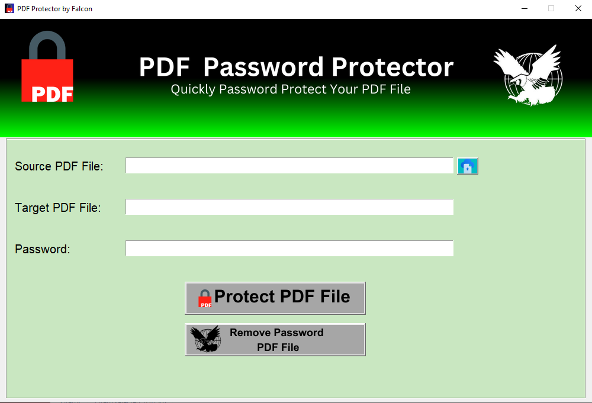

# PDF Protector by Falcon
**Creator:** Paul Mendoza   
**Created on:** December 31, 2024    
**Connect with Me:**   
* Facebook: [Paul Mendoza](https://www.facebook.com/mypaulmendoza/)
* Instagram: [Paul Mendoza](https://www.instagram.com/mypaulmendoza/)
       
PDF Protector by Falcon is a Python-based application designed to protect PDF files by adding a password or removing passwords from encrypted PDF files. The program utilizes the `PyPDF2` library for PDF manipulation and `Tkinter` for the graphical user interface.
# Features:
Protect a PDF with Password: Encrypt a PDF file by adding a password to it.
Remove Password from a Protected PDF: Decrypt a PDF file by removing its password (requires the original password).
Simple User Interface: The app provides a simple and intuitive interface to browse files, enter passwords, and perform actions.
## Requirements:
* Python 3.x
* Libraries:
`Tkinter` (for the GUI)
`PyPDF2` (for PDF handling)

## You can install the required libraries using:

    pip install PyPDF2

## How to Run:
1. Download the source code files to your local machine.    
2. Make sure the following images are in the `images/` folder in the same directory as your Python script:
  * `icon.png` (app icon)
  * `images1.png` (header image)
  * `select_icon.png` (icon for selecting files)
  * `btn_image.png` (icon for the Protect button)
  * `remove_password_image.png` (icon for the Remove Password button)
  * `remove_pass.png` (icon for removing the password from PDF)
3. Run the Python script:

       python pdf_protector.py
## Usage: 
### Protect PDF with Password:
1. Click on the "Browse" button to select the source PDF file you want to protect.
2. Enter the target filename for the protected PDF file.
3. Enter the password you want to set for the PDF file.
4. Click the "Protect PDF" button to apply the password.
### Remove Password from Protected PDF:
1. Click the "Remove Password" button to open a new window.
2. Browse and select the protected PDF file.
3. Enter the target filename for the new unprotected PDF.
4. Enter the password to decrypt the PDF (if correct, the password will be removed).
5. Click the "Remove Password" button to process.
### Forgot Password:
  * If you forget the password for a PDF, click the "Forgot Password?" button to see potential solutions to recover the password.
## Troubleshooting:
  * If any required images are missing, an error message will be displayed.
  * If the PDF file is not properly selected or the password is incorrect, error messages will appear to guide you.
## Screenshot:
  
